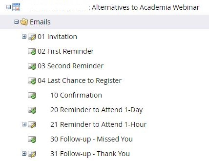
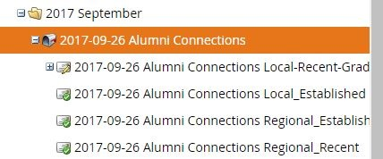

# Marketo Data Model

## Tables
For security reasons, only last part of the table name is mentioned here.  

    * Leads  
    	- Stores constituent/lead information
    * Program  
    	- Stores all the program information including Email and Events
    * Email
    	- Stores all the email information including parent - child relationships between email

    * Activity  
    	- Stores all the activity log
    * Campaigns  
    	- Stores individual email information that are part of an event

## QUERY
Please refer to the following query.
* [email_info.sql](sql/email_info.sql) : Calculates click through information of an email
* [event_info.sql](sql/event_info.sql) : Calculates number of registered, attended people of an event


## JOIN TABLES

* Program : Activity  
`Program.id = Activity.primaryAttributeValueId`

* Program : Email  
`Program.id = Email.programId`

Note: API endpoint for Email sends programId inside the nested json for `{..., 'folder':{'value':programId}}`.
We unnest the nested structure and rename `value` to `programId`

* Email : Activity  
`Email.id = Activity.primaryAttributeValueId`

* Program : Campaigns  
`Program.Id = Campaigns.Id`

* Leads : Activity  
`Leads.Id = Activity.leadId`

## Get list of emails and events

Use the column `Program.channel` and subset to the following values to get the list of emails and events.

|channel|
|:-------:|
|Email|
|Email Blast|
|Subscription|
|Webinar|
|Fundraising|
|Nurture|
|Standard Event|


## EVENT
An event (denoted by :date:) is considered as a program. One or more emails can be part of an event. E.g.,



### Count event's attendance 
The following query will provide the number of attendee of all the events.

```
--NOTE: Schema and table names are dummy for security reasons. Replace dummy names

use YOUR_SCHEMA_NAME;

select
	[Program Id],
	[Program Name],
	count(1) [Count attendee]

from (
	select 
		distinct 
			 p.id 'Program Id',
			 p.name 'Program Name', 
			 a.leadId
	FROM [dbo].[Program] p
		inner join [dbo].[Activity] a
			on p.id = a.primaryAttributeValueId

	where p.channel in ('Webinar', 'Standard Event')
		and a.activityTypeName = 'Change Status in Progression'
		and ([New Status] like 'Attended%' or [Old Status] like 'Attended%') 

) program_lead

group by [Program Id], [Program Name]
```


## EMAIL  
An email (denoted by :mailbox_with_no_mail:) can have one or emails associated with them. 


However, Program table will contain only one record describing the parent email. Activity table will contain logs related to sub individual emails. Email name will be in the format `PARENT EMAIL NAME.CHILD EMAIL NAME`. In order to get all logs related to the Email program, use the following query.


Query 1:  
```
use YOUR_SCHEMA_NAME;

select *
from    (
		select *
		from [dbo].[Program]
		where channel in ('Email', 'Email Blast')
	) p

	left join [dbo].[Email] e
		on p.id = e.programId

	left join (
		select *
		from [dbo].[Activity] a
		where a.activityTypeName in ('Send Email', 'Open Email', 'Click Email')
	) a

		on e.id = a.primaryAttributeValueId
```

## Data Inclusion Criteria
We remove some records crawled through the API that are not necessary. Following are the records that we keep:


* For field `activityTypeName` we keep the following value:
	- Visit Webpage
	- Click Link
	- Send Email
	- Email Bounced
	- Unsubscribe Email
	- Open Email
	- Click Email
	- Email Bounced Soft
	- Change Status in Progression

* For `[activityTypeName]= ‘Change Status in Progression’`, fields (`New Status` or `Old Status`) must take a value from the list below:
	- Attended
	- Attended On-demand
	- Can Not Attend
	- Wait Listed
	- Interested
	- Invited
	- No Show
	- Not Interested
	- Registered


## Comments
- Marketo data warehouse integration guide(http://developers.marketo.com/support/Marketo_DB_Reference_Architecture.pdf)
- Not all the email program will have records in the `Campaign` table
- An email program has records in the `Campaign` table if it contains an item of type `Campaign`
